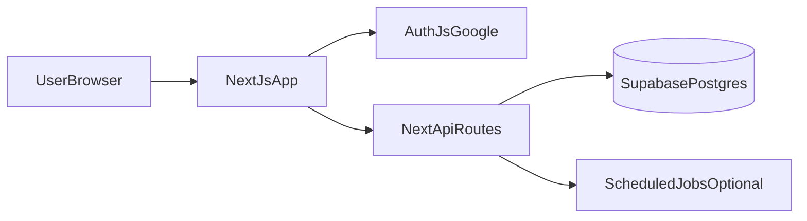

# Architecture evolutive gratuite pour Poke Challenge

## Decision validee

- **Hebergement frontend + API**: **Vercel** (free tier)
- **Base de donnees**: **Supabase Postgres** (free tier)
- **Authentification Google**: **Auth.js (NextAuth)**
- **ORM**: **Prisma**
- **Redis**: reporte a une phase future, uniquement si necessaire

## Recommandation principale (simple + scalable + gratuit au depart)

- **Frontend + API**: conserver **Next.js App Router** (`app/` + `app/api/`) pour eviter un second backend.
- **Auth Google**: **Auth.js** avec provider Google.
- **Base de donnees**: **Supabase Postgres** comme source de verite unique.
- **ORM**: **Prisma** (migrations, typage fort, iteration rapide).
- **Deploiement**: **Vercel** + variables d'environnement connectees a Supabase.

Cette base permet d'ajouter rapidement des features tout en restant gratuite et sans complexifier l'architecture trop tot.

## Pourquoi cette approche

- Tu evites de maintenir 2 apps (frontend + backend separes).
- Tu gardes toute la logique metier pres du produit via `app/api/*`.
- Prisma + Supabase Postgres couvrent bien users, profils, parties, saisons et classements.
- Auth.js s'integre proprement avec Next.js pour le login Google.

## Architecture cible

## Modele de donnees (MVP puis extension)

### MVP

- `User`
    - `id`, `email`, `name`, `avatarUrl`, `createdAt`
- `UserProfile`
    - `userId`, `preferredInterfaceMode`, `enabledGameModes`, `region`, `updatedAt`
- `Match`
    - `id`, `userId`, `mode`, `isRanked`, `score`, `durationMs`, `accuracy`, `createdAt`
- `LeaderboardEntry` (calculee ou materialisee)
    - `userId`, `seasonId`, `mode`, `rating`, `rank`, `updatedAt`
- `Season`
    - `id`, `name`, `startsAt`, `endsAt`, `isActive`

### Extension

- `RatingHistory` (historique Elo/Glicko)
- `MatchEvent` (audit anti-cheat / replay)
- `Achievement`, `UserAchievement`

## API: rester dans Next.js

Endpoints cibles dans `app/api/*`:

- `POST /api/auth/*` (Auth.js)
- `GET/PUT /api/profile`
- `POST /api/ranked/match/start`
- `POST /api/ranked/match/finish`
- `GET /api/leaderboard?mode=&season=`

## Strategie leaderboard sans Redis (phase actuelle)

- **Phase 1**: calcul SQL direct avec index (`ORDER BY rating DESC`) + pagination.
- **Phase 2**: materialisation partielle (table de snapshots ou vue materialisee) + refresh cron.
- **Phase 3**: optimisation requetes et indexes supplementaires selon les usages reels.

## Parties classees

- Demarrer sur un **Elo simple** par mode.
- Ajouter des garde-fous minimums:
    - minimum de manches
    - cooldown anti-spam
    - validation serveur de score
- Stocker toutes les parties classees (`Match`) pour recalcul possible.

## Plan d'implementation en 4 phases

### Phase 1 - Fondations backend

- Ajouter Prisma + connexion Supabase Postgres.
- Creer schema initial (`User`, `UserProfile`, `Match`, `Season`).
- Brancher Auth.js Google.
- Ajouter middleware de session serveur.

### Phase 2 - Profil utilisateur

- Creer endpoints `GET/PUT /api/profile`.
- Ajouter page profil (preferences interface + modes visibles).
- Lire preferences au chargement de l'app.

### Phase 3 - Ranked + leaderboard MVP

- Creer endpoints start/finish de parties classees.
- Calcul Elo cote serveur.
- Creer endpoint leaderboard pagine.
- Ajouter page leaderboard (global + par mode).

### Phase 4 - Robustesse et cout

- Ajouter indexes DB cibles (`userId`, `mode`, `createdAt`, `rating`).
- Ajouter jobs de consolidation leaderboard si besoin.
- Ajouter observabilite (logs d'erreurs, metriques simples).
- Ajouter protection anti-triche progressive.

## Deploiement gratuit retenu

- **Vercel (frontend + API routes)**: free tier pour demarrer.
- **Supabase Postgres free**: base relationnelle principale.
- **Redis**: non deployee pour l'instant.

## Dossiers cibles a introduire

- `prisma/schema.prisma`
- `lib/db/prisma.ts`
- `lib/auth/config.ts`
- `app/api/profile/route.ts`
- `app/api/ranked/**`
- `app/api/leaderboard/route.ts`
- `app/profile/page.tsx`
- `app/leaderboard/page.tsx`

## Risques et garde-fous

- **Limites free tier**: eviter les recalculs complets a chaque requete leaderboard.
- **Cold starts**: endpoints courts, indexes precoces.
- **Securite score**: ne jamais accepter un score brut sans verification serveur.
- **Evolutivite**: isoler lecture leaderboard et ecriture des parties des le MVP.

## Resultat attendu

A la fin de ce plan, tu auras:

- login Google,
- profils personnalisables,
- parties classees,
- leaderboard fiable,
- architecture evolutive et economique pour le deploiement.
