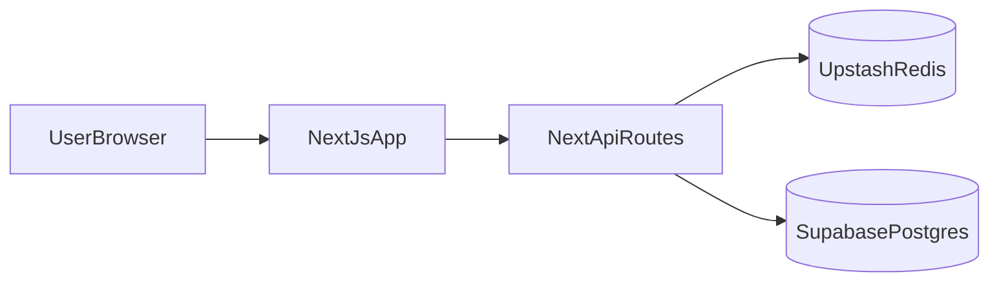

# Plan Redis evolutif (a lancer apres le MVP)

## Objectif

Introduire Redis de maniere incrementale, seulement si les indicateurs montrent que Supabase seul devient un goulot d'etranglement sur les endpoints chauds (leaderboard/ranked).

## Pre-conditions avant d'ajouter Redis

- MVP en production (auth, profil, ranked, leaderboard) stable.
- Requetes SQL leaderboard indexees et profilees.
- Monitoring basique en place (latence p95, p99, erreurs, consommation DB).

## Critere de declenchement (Go Redis)

Declencher Redis seulement si au moins un de ces points se confirme:

- latence p95 leaderboard > 400 ms de maniere recurrente,
- pics de charge DB lors des heures de pointe,
- besoin de rate limiting fin par utilisateur/IP,
- cout requetes DB qui augmente plus vite que le trafic utile.

## Hebergement Redis recommande

- **Upstash Redis (free tier)** pour rester aligne avec l'objectif gratuit et serverless sur Vercel.

## Use cases Redis par priorite

1. **Cache leaderboard lecture seule**
   - cles: `leaderboard:{season}:{mode}:{page}`
   - TTL court (30s a 120s)
2. **Cache tops frequents**
   - `top10`, `top100`, `topRegion`
3. **Rate limiting endpoints sensibles**
   - `/api/ranked/match/finish`, `/api/leaderboard`
4. **Locks courts anti-double-submit**
   - eviter l'envoi multiple d'une meme fin de partie

## Strategie d'invalidation (obligatoire)

- Invalidation par evenement apres ecriture de match classe:
  - suppression selective des cles de leaderboard concernees,
  - fallback TTL en securite pour eviter stale infini.

## Architecture cible avec Redis

## Plan d'implementation adaptable

### Etape 1 - Audit du code courant

- Re-lire les endpoints reels existants au moment du lancement (`app/api/ranked/**`, `app/api/leaderboard/route.ts`).
- Identifier les nouveaux patterns introduits depuis ce plan.

### Etape 2 - Couche technique Redis

- Ajouter client Redis centralise (`lib/cache/redis.ts`).
- Ajouter helper de cache (`getOrSet`, `invalidateByPattern` controle).

### Etape 3 - Integration fonctionnelle progressive

- Brancher d'abord `GET /api/leaderboard`.
- Ajouter ensuite rate limiting sur endpoints ranked.
- Garder un fallback DB robuste en cas de timeout Redis.

### Etape 4 - Verification et rollback

- Mesurer hit rate cache, latence API, charge DB.
- Conserver un feature flag pour activer/desactiver Redis rapidement.

## Definition of Done

- Baisse mesurable de latence p95 leaderboard.
- Baisse des requetes DB sur endpoints cibles.
- Aucune regression fonctionnelle sur classement.
- Possibilite de desactiver Redis sans interruption service.

## Notes d'adaptation future

Ce plan doit etre relu avant execution pour:

- aligner les noms de routes/fichiers avec le code reel du moment,
- ajuster les cles de cache aux nouvelles dimensions (saison, region, mode custom),
- integrer les futures features ranked qui n'existent pas encore aujourd'hui.
